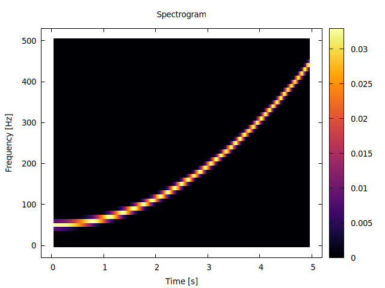
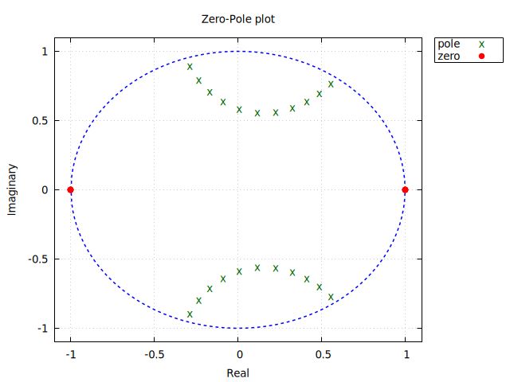
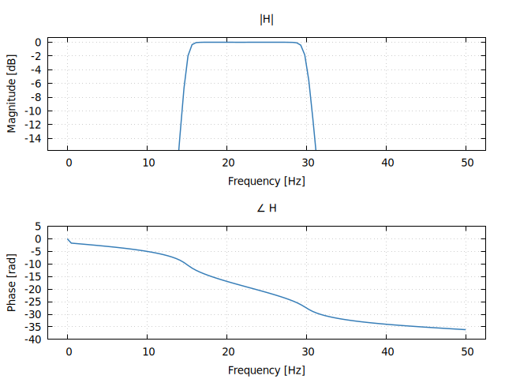
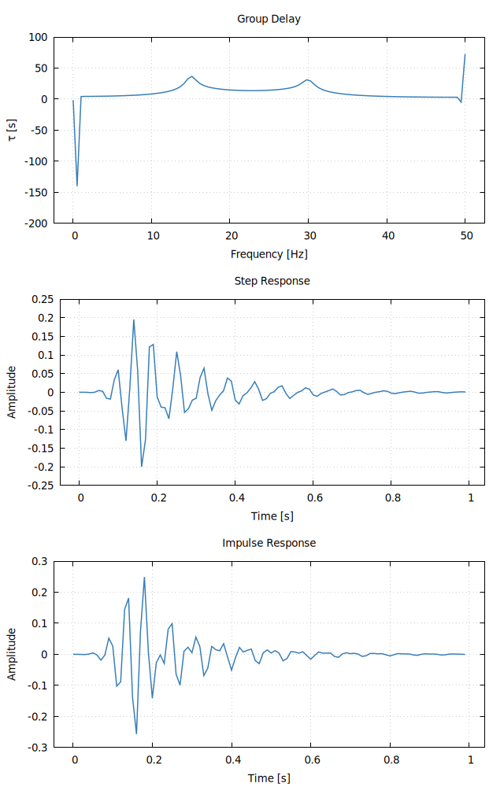
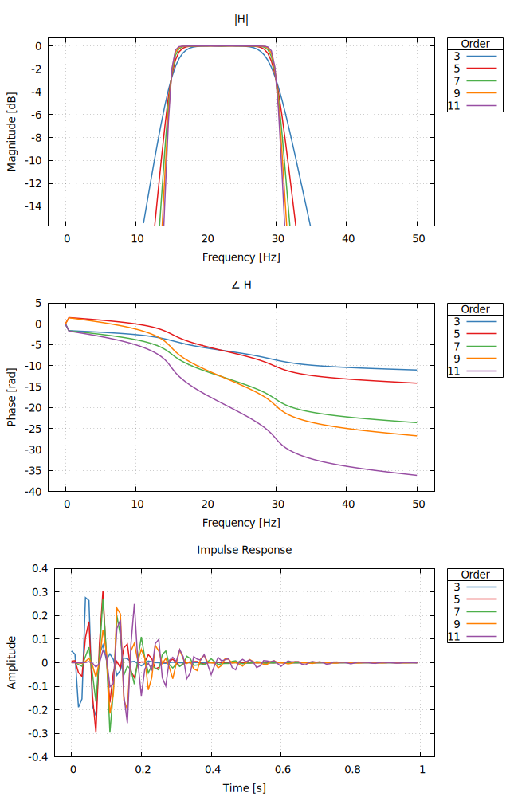
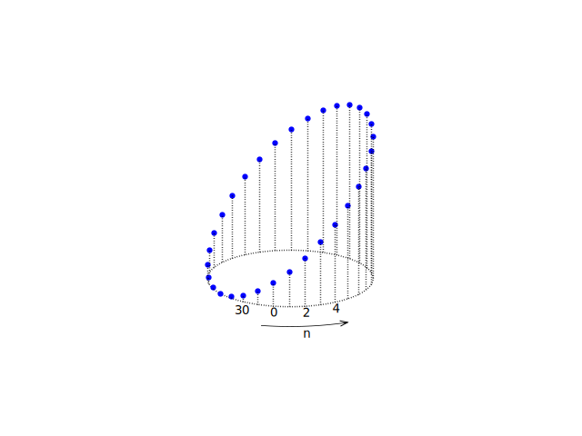

`GastonDSP` is a Julia package that allows plotting of
[`DSP.jl`](https://github.com/JuliaDSP/DSP.jl) types using
[`Gaston`](https://github.com/mbaz/Gaston.jl).

In its current state, this package provides limited functionality. The number and
flexibility of recipes will improve over time.

Recipes for the following types are provided:

* Spectrograms
* FilterCoefficients
* Stem plot on a circular axis (for data sequences)

### Examples

#### `Spectrogram`

```julia
using DSP, GastonDSP, Gaston

fs = 1000 # sampling frequency in Hz
t1 = 5    # some time in seconds
f0 = 50  # initial frequency
f1 = 450  # frequency in Hz at t1
D = 5 # time duration
t = range(0, D, step = 1/fs) # time
# quadratic chirp
β = (f1 - f0)/(t1^2)
f(t) = f0 + β*t^2    # instantaneous frequency
# phase - integral of f(t)
ϕ = [0.0]
for i in 1:length(t)-1
    push!(ϕ, ϕ[end] + f(t[i])/fs)
end
s = cos.(2π*ϕ)    # chirp signal
ov = 100          # overlap
win = hanning(ov) # window
sp = spectrogram(s, ov, 80, fs = fs, window = win)    # spectrogram
@plot {palette = :inferno} "set title 'Spectrogram'" sp
```



#### `FilterCoefficients`

```julia
fs = 100
responsetype = Bandpass(15, 30)
designmethod = Butterworth(11)
flt = digitalfilter(responsetype, designmethod; fs=fs)
```

##### Zero-pole plot

```julia
plot(flt, type = :zp, fs = fs)
```



##### Magnitude and phase response

```julia
plot(flt, fs = fs)
```



##### Group delay, impulse and step responses

```julia
plot(flt, type = (:grpdelay, :stepresp, :impresp), fs = fs)
```



##### Comparison of different filter orders

This example plots the filter magnitude and phase response for orders 3, 5,
7, 9 and 11.

```julia
orders = [3, 5, 7, 9, 11]
plot(digitalfilter.((Bandpass(15, 30),), Butterworth.(orders), fs = fs)...,
     type = (:mag, :impresp), fs = fs, keys = orders)
```



#### Stem plot on a circular axis

This plot type is inspired by [this blog post](https://www.dsprelated.com/showarticle/1435.php)
by Richard Lyons. It works best for sequences of at most 32 points.

```julia
n = 1 .+ sin.(2π.*range(0,1-1/32,length=32) .- π/4)
plot(GastonDSP.CircStem, n)
```


